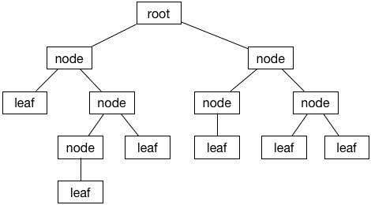

# Binary Tree

A binary tree is a [tree](../Tree/) where each node has 0, 1, or 2 children.This is a binary tree:



The child nodes are usually called the "left" child and the "right" child. If a node doesn't have any children, it's called a *leaf* node. The *root* is the node at the very top of the tree (programmers like their trees upside down).

Often nodes will have link back to their parent but this is not strictly necessary.

Binary trees are often used as [Binary search trees](../Binary Search Tree/). In that case, the nodes must be in a specific order (smaller values on the left, larger values on the right). But this is not a requirement for all binary trees.

For example, here is a binary tree that represents a sequence of arithmetical operations, `(5 * (a - 10)) + (-4 * (3 / b))`:


## The code

Here's how you could implement a general-purpose binary tree in Swift:

```swift
public indirect enum BinaryTree<T> {
  case Node(BinaryTree<T>, T, BinaryTree<T>)
  case Empty
}
```
As an example of how to use this, let's build that tree of arithmetic operations:
```swift
// leaf nodes
let node5 = BinaryTree.Node(.Empty, "5", .Empty)
let nodeA = BinaryTree.Node(.Empty, "a", .Empty)
let node10 = BinaryTree.Node(.Empty, "10", .Empty)
let node4 = BinaryTree.Node(.Empty, "4", .Empty)
let node3 = BinaryTree.Node(.Empty, "3", .Empty)
let nodeB = BinaryTree.Node(.Empty, "b", .Empty)

// intermediate nodes on the left
let Aminus10 = BinaryTree.Node(nodeA, "-", node10)
let timesLeft = BinaryTree.Node(node5, "*", Aminus10)

// intermediate nodes on the right
let minus4 = BinaryTree.Node(.Empty, "-", node4)
let divide3andB = BinaryTree.Node(node3, "/", nodeB)
let timesRight = BinaryTree.Node(minus4, "*", divide3andB)

// root node
let tree = BinaryTree.Node(timesLeft, "+", timesRight)
```

You need to build up the tree in reverse, starting with the leaf nodes and working your way up to the top.

It will be useful to add a `description` method so you can print the tree:

```swift
extension BinaryTree: CustomStringConvertible {
  public var description: String {
    switch self {
    case let .Node(left, value, right):
      return "value: \(value), left = [" + left.description + "], right = [" 
                                         + right.description + "]"
    case .Empty:
      return ""
    }
  }
}
```

If you `print(tree)` you should see something like this:

	value: +, left = [value: *, left = [value: 5, left = [], right = []], right = [value: -, left = [value: a, left = [], right = []], right = [value: 10, left = [], right = []]]], right = [value: *, left = [value: -, left = [], right = [value: 4, left = [], right = []]], right = [value: /, left = [value: 3, left = [], right = []], right = [value: b, left = [], right = []]]]

With a bit of imagination, you can see the tree structure. ;-) It helps if you indent it:

	value: +, 
		left = [value: *, 
			left = [value: 5, left = [], right = []], 
			right = [value: -, 
				left = [value: a, left = [], right = []], 
				right = [value: 10, left = [], right = []]]], 
		right = [value: *, 
			left = [value: -, 
				left = [], 
				right = [value: 4, left = [], right = []]], 
			right = [value: /, 
				left = [value: 3, left = [], right = []], 
				right = [value: b, left = [], right = []]]]

Another useful method is counting the number of nodes in the tree:

```swift
  public var count: Int {
    switch self {
    case let .Node(left, _, right):
      return left.count + 1 + right.count
    case .Empty:
      return 0
    }
  }
```

On the tree from the example, `tree.count` should be 12.

Something you often need to do with trees is traverse them, i.e. look at all the nodes in some order. There are three ways to traverse a binary tree:

1. *In-order* (or *depth-first*): first look at the left child node, then at the node itself, and finally at the right child.
2. *Pre-order*: first look at a node, then its left and right children. 
3. *Post-order*: first look at the left and right children and process the node last.

Here is how you'd implement that:

```swift
  public func traverseInOrder(@noescape process: T -> Void) {
    if case let .Node(left, value, right) = self {
      left.traverseInOrder(process)
      process(value)
      right.traverseInOrder(process)
    }
  }
  
  public func traversePreOrder(@noescape process: T -> Void) {
    if case let .Node(left, value, right) = self {
      process(value)
      left.traversePreOrder(process)
      right.traversePreOrder(process)
    }
  }
  
  public func traversePostOrder(@noescape process: T -> Void) {
    if case let .Node(left, value, right) = self {
      left.traversePostOrder(process)
      right.traversePostOrder(process)
      process(value)
    }
  }
```

As is common when working with tree structures, these functions call themselves recursively.

For example, if you traverse the tree of arithmetic operations in post-order, you'll see the values in this order:

	5
	a
	10
	-
	*
	4
	-
	3
	b
	/
	*
	+

The leaves appear first. The root node appears last.

You can use a stack machine to evaluate these expressions, something like the following pseudocode:

```swift
tree.traversePostOrder { s in 
  switch s {
  case this is a numeric literal, such as 5:
    push it onto the stack
  case this is a variable name, such as a:
    look up the value of a and push it onto the stack
  case this is an operator, such as *:
    pop the two top-most items off the stack, multiply them,
    and push the result back onto the stack
  }
  the result is in the top-most item on the stack
}
```

*Written for Swift Algorithm Club by Matthijs Hollemans*
